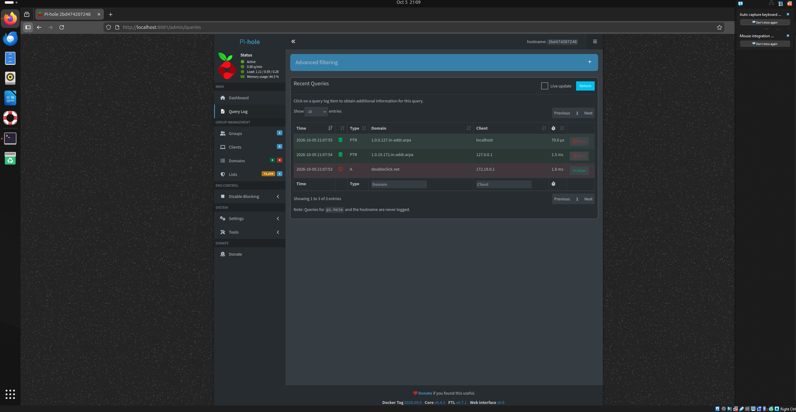
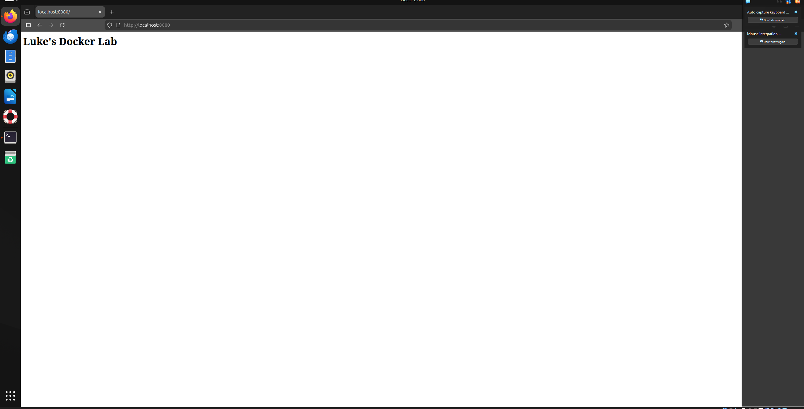

# Docker Homelab: Nginx, PostgreSQL, and Pi-hole

A containerized homelab running three services on an Ubuntu 24.04 virtual machine (Oracle VirtualBox), defined in a single Docker Compose file. I built this to get hands-on experience with containers, persistent storage, and DNS filtering, and to practice troubleshooting real problems along the way.

## What's Running

| Service | Image | Port (VM → Container) | Purpose |
|---|---|---|---|
| **web** | `nginx` | 8080 → 80 | Serves a custom web page from a read-only bind mount |
| **db** | `postgres:16` | internal only | PostgreSQL database with data stored in a named volume |
| **pihole** | `pihole/pihole` | 1053 → 53/udp, 8081 → 80 | Network-level DNS filtering with a web dashboard |

All three services use `restart: unless-stopped` so they come back up automatically after a reboot.

## Skills Demonstrated

- Installing and configuring Docker Engine and Docker Compose on Linux
- Translating `docker run` commands into a declarative Compose file
- Port mapping, bind mounts, and named volumes
- Verifying data persistence across container deletion and recreation
- DNS testing and validation with `dig`
- Diagnosing failures using error messages, container logs, and network tests
- Keeping generated data and credentials out of version control

## How to Run

```bash
git clone https://github.com/LukeJ2006/docker-homelab.git
cd docker-homelab
docker volume create pgdata        # the db service uses an existing external volume
mkdir -p ~/site && echo "<h1>Docker Lab</h1>" > ~/site/index.html
docker compose up -d
docker ps
```

> **Note:** The web service mounts `/home/labuser/site`. Update that path to match your own home folder.

## Testing and Results

**Web server:** `http://localhost:8080` serves the custom page.

**Database persistence:** I created a `tickets` table, deleted the container with `docker rm -f`, recreated it, and confirmed the data was still there because it lives in the `pgdata` volume, not in the container.

```bash
docker exec -it docker-homelab-db-1 psql -U postgres -c "SELECT * FROM tickets;"
```

```
 id |      issue
----+-----------------
  1 | Printer offline
  2 | Account locked
(2 rows)
```

**DNS filtering:** Pi-hole returns `0.0.0.0` for blocked ad domains and a real address for normal ones.

```bash
dig @127.0.0.1 -p 1053 doubleclick.net   # blocked → 0.0.0.0
dig @127.0.0.1 -p 1053 google.com        # allowed → real IP
```

The Pi-hole Query Log confirms `doubleclick.net` was blocked, with about 72,000 domains on the blocklist.

## Screenshots







## Troubleshooting Log

Things broke along the way. Here's what happened and how I fixed each one.

**1. VM couldn't reach the internet.** Installing Docker failed with `Could not resolve host`. I ran `ping` tests against an IP address and a domain name to separate a connectivity problem from a DNS problem. The VM's bridged network adapter wasn't connecting, so I switched VirtualBox to NAT, which restored access. Tradeoff: with NAT, services are reached from inside the VM (`localhost`) unless port forwarding is configured.

**2. Port conflict with a system service.** My first Pi-hole test on port 5353 timed out. Port 5353 is used by Avahi (multicast DNS) on Ubuntu desktop, so my queries never reached Pi-hole. I moved Pi-hole's DNS to port 1053. Checking with `sudo ss -ulnp | grep 5353` shows Avahi holding that port.

**3. Compose file failed validation.** `docker compose up` returned `services.pihole.environemnt false schema`. A typo (`environemnt`) meant Docker rejected the file, so Pi-hole never started, which is why port 1053 returned `connection refused`. Reading the error closely pointed directly to the misspelled key.

**4. Dashboard rejected the password.** Pi-hole's logs showed `No password set... assigning random password` and a warning that `FTLCONF_websever_api_password` was unknown. A typo in the variable name meant Pi-hole ignored my setting. After fixing it, I learned that Compose only applies changes when containers are recreated (`docker compose down` then `up -d`), not while they're running.

**5. Containers had the wrong project name.** After launching the stack, containers were named `labuser-*` instead of `docker-homelab-*`. I had saved the Compose file in my home folder, and Docker Compose searches parent directories when it doesn't find a file in the current one, then names the project after that folder. Moving the file into the project folder fixed it.

**Also:** Pi-hole in Docker's default bridge network needs `FTLCONF_dns_listeningMode: "all"` to answer queries coming through Docker's port mapping.

## Security Notes

- The passwords in `docker-compose.yml` are lab placeholders. In a real deployment I would move them into a `.env` file and add it to `.gitignore`.
- `etc-pihole/` is excluded with `.gitignore`, since it contains generated runtime data.
- PostgreSQL's port is not published to the host, so the database is only reachable from inside Docker's network.
